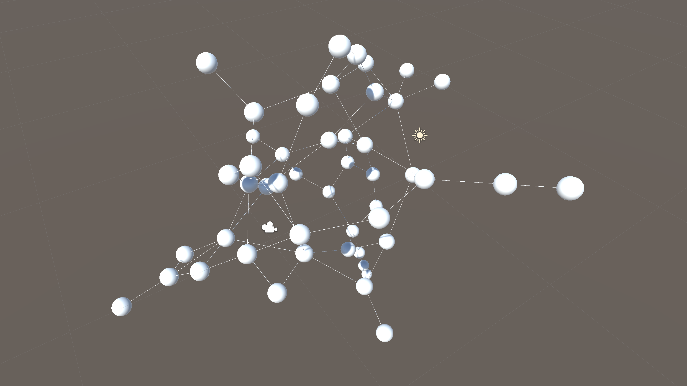

A force directed graph simulation that uses Unity's Job System.  

Run the DemoRandomFDG scene for a random force directed graph. The random values can be adjusted by the sliders on the ForceDirectedGraph component.  

A Node MonoBehaviour can be attached to any GameObject and run in the ForceDirectedGraph.  

Hold the right mouse button for free-look.  

